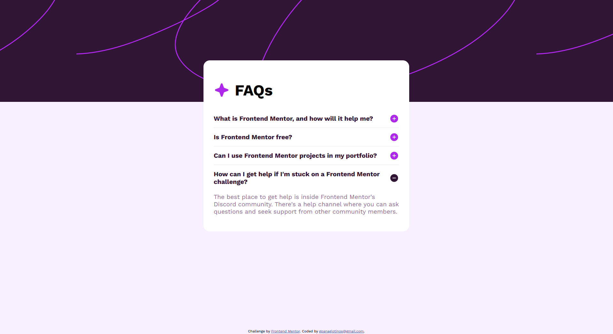
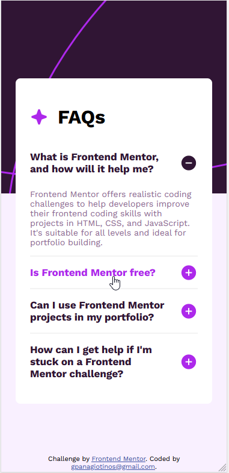
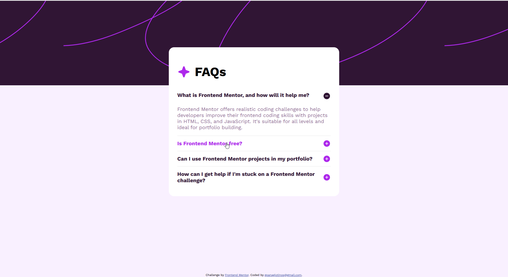

# Frontend Mentor - FAQ accordion solution

This is a solution to the [FAQ accordion challenge on Frontend Mentor](https://www.frontendmentor.io/challenges/faq-accordion-wyfFdeBwBz). Frontend Mentor challenges help you improve your coding skills by building realistic projects. 

## Table of contents

- [Frontend Mentor - FAQ accordion solution](#frontend-mentor---faq-accordion-solution)
  - [Table of contents](#table-of-contents)
  - [Overview](#overview)
    - [The challenge](#the-challenge)
    - [Screenshot](#screenshot)
    - [Links](#links)
  - [My process](#my-process)
    - [Built with](#built-with)
    - [What I learned](#what-i-learned)
  - [Author](#author)

## Overview

### The challenge

Users should be able to:

- Hide/Show the answer to a question when the question is clicked
- Navigate the questions and hide/show answers using keyboard navigation alone
- View the optimal layout for the interface depending on their device's screen size
- See hover and focus states for all interactive elements on the page

### Screenshot





### Links

- Solution URL: [Solution](https://gpanagiotinos.github.io/faq-accordion-main/)
- Live Site URL: [Site Url](https://gpanagiotinos.github.io/faq-accordion-main/)

## My process

### Built with

- Semantic HTML5 markup
- CSS custom properties
- Flexbox
- CSS Grid
- Mobile-first workflow
- [Javascript](https://www.javascript.com/) - Javascript


### What I learned

In this challenge, I learned how to create an interactive FAQ accordion card using HTML, CSS, and JavaScript. I implemented the functionality to hide and show answers when the corresponding question is clicked, allowing users to easily navigate through the questions. To enhance the user experience, I incorporated CSS animations to add a touch of elegance and interactivity to the accordion card. The animations were used to smoothly transition the accordion icon when toggling between hiding and showing answers, creating a visually appealing effect that enhances the overall user experience. Additionally, I ensured that the layout of the interface adapts seamlessly to different screen sizes, providing an optimal viewing experience on various devices. Throughout the development process, I focused on creating visually appealing hover and focus states for all interactive elements, such as the questions and the accordion icon, to provide clear feedback to the user. By completing this challenge, I gained valuable experience in combining HTML for structure, CSS for styling and animations, and JavaScript for interactivity, ultimately creating a functional and engaging FAQ accordion card with a visually captivating user experience.

To see how you can add code snippets, see below:


```css
.switch-to-plus-icon > .article-icon {
  animation: rotate-to-plus-icon 1s 1;
}
.switch-to-minus-icon > .article-icon {
  animation: rotate-to-minus-icon 1s 1;
}

@keyframes rotate-to-plus-icon {
  0%, 50% {
    transform: rotate(-75deg);
    background-image: url("../images/icon-minus.svg");
  }
  50%, 100% {
    transform: rotate(-180deg);
    background-image: url("../images/icon-plus.svg");
  }
}
@keyframes rotate-to-minus-icon {
  0%, 50% {
    transform: rotate(75deg);
    background-image: url("../images/icon-plus.svg");
  }
  50%, 100% {
    transform: rotate(180deg);
    background-image: url("../images/icon-minus.svg");
  }
}
```
```js
const articles = ["article-1", "article-2", "article-3", "article-4"];
const onClickArticle = (clickedArticleId, event) => {
  articles.forEach((articleId) => {
    const articleEl = document.getElementById(articleId);
    const currentClass = articleEl.className.split(" ");
    if (clickedArticleId === articleId) {
      if (currentClass.indexOf("hidden") < 0) {
        articleEl.classList.add("hidden", "switch-to-plus-icon");
      } else {
        articleEl.classList.remove("hidden");
        articleEl.classList.add("switch-to-minus-icon");
      }
    } else {
      if (currentClass.indexOf("hidden") < 0) {
        articleEl.classList.add("hidden", "switch-to-plus-icon");
        articleEl.classList.remove("switch-to-minus-icon");
      }
    }
  });
};
const main = () => {
  articles.forEach((articleId) => {
    const articleEl = document.getElementById(articleId);
    articleEl.onclick = onClickArticle.bind(this.onClickArticle, articleId);
  });
};
```

## Author

- Website - [Georgios Panagiotinos](https://code.panagiotinos.com/)
- Frontend Mentor - [@gpanagiotinos](https://www.frontendmentor.io/profile/gpanagiotinos)
- Github - [@gpanagiotinos](https://github.com/gpanagiotinos)